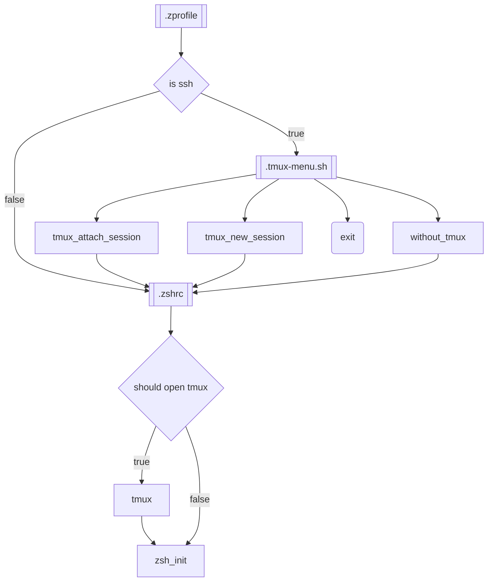

# shell start process

```mermaid
flowchart TD
    .zprofile[[.zprofile]] --> is_ssh{is ssh}
    is_ssh -->|true| .tmux-menu.sh[[.tmux-menu.sh]]
    is_ssh -->|false| .zshrc[[.zshrc]]

    .tmux-menu.sh --> tmux_attach_session --> .zshrc
    .tmux-menu.sh --> tmux_new_session --> .zshrc
    .tmux-menu.sh --> without_tmux --> .zshrc
    .tmux-menu.sh --> exit(exit)

    .zshrc --> open_tmux{should open tmux}
    open_tmux -->|true| tmux --> zsh_init
    open_tmux -->|false| zsh_init
```
